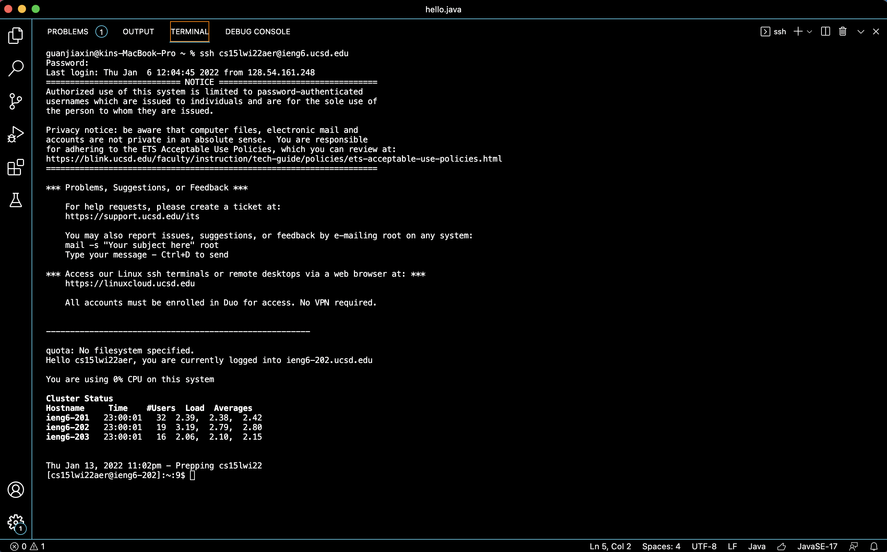

report1

First, we downloaded and installed Visual Studio Code.
My computer is MAC.

Second, we connect to a remote computer over the Internet to do work there.
I typed my course-specific account and entered my password.
This is the screenshot showing that I have successfully connected.

Then, I tried to run some commands.
I ran: ls, ls -a, ls -lat

